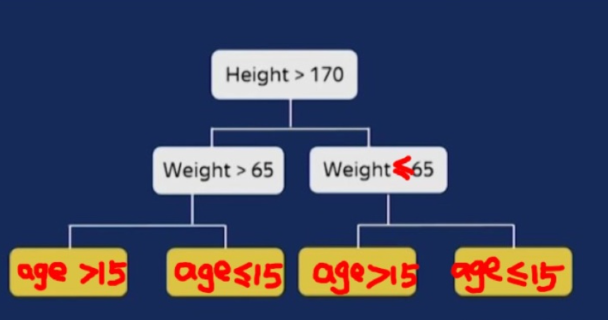

# 梯度提升算法对比总结

## GBDT

## XGBOOST

## LightGBM

## CATBOOST

>CatBoost是一种基于对称决策树（oblivious trees）为基学习器实现的参数较少、支持类别型变量和高准确性的GBDT框架，主要解决的痛点是高效合理地处理类别型特征，这一点从它的名字中可以看出来，CatBoost是由Categorical和Boosting组成。此外，CatBoost还解决了梯度偏差（Gradient Bias）以及预测偏移（Prediction shift）的问题，从而减少过拟合的发生，进而提高算法的准确性和泛化能力。[csdn](https://blog.csdn.net/weixin_49708196/article/details/124018649)

### catboost 优点
- 性能卓越：在性能方面可以匹敌任何先进的机器学习算法

- 鲁棒性/强健性：它减少了对很多超参数调优的需求，并降低了过度拟合的机会，这也使得模型变得更加具有通用性
- 易于使用：提供与 scikit 集成的 Python 接口，以及 R 和命令行界面

- 实用：可以处理类别型、数值型特征

- 可扩展：支持自定义损失函数

- 支持类别型变量，无需对非数值型特征进行预处理

- 快速、可扩展的GPU版本，可以用基于GPU的梯度提升算法实现来训练你的模型，支持多卡并行

- 快速预测，即便应对延时非常苛刻的任务也能够快速高效部署模型

### catboost缺点

- 对于类别型特征的处理需要大量的内存和时间

- 不同随机数的设定对于模型预测结果有一定的影响

### 与XGBoost和LightGBM相比CatBoost的创新点

- 嵌入了自动将类别型特征处理为数值型特征的创新算法。首先对categorical features做一些统计,计算某个类别特征（category）出现的频率,之后加上超参数,生成新的数值型特征（numerical features）。

- Catboost 还使用了组合类别特征，可以利用到特征之间的联系，这极大的丰富了特征维度。

- 采用排序提升的方法对抗训练集中的噪声点，从而避免梯度估计的偏差，进而解决预测偏移的问题。

- 采用了完全对称树作为基模型。

- 采用一种新的算法计算 leaf-values 。

### 处理类别特征的方法

对于类别特征，如果类别数目不多，可以使用onehot编码。否则，很容易造成维度爆炸。catboost 不提倡使用one-hot编码，它设计了一种**基于预测目标统计值**的方法可以将类别特征转化为数值特征。颇有均值编码的思想。

CatBoost 使用一个更有效的策略，一方面可以减少过拟合，另一方面使用全部数据来训练。对数据集先随机排序，对于每个样本的该类别特征中的某个取值，转换为数值型时都是基于该样本之前的类别label value取均值，同时加入了优先级（先验值）的权重系数。
假设 $\sigma=\left(\sigma_{1}, \sigma_{2}, \cdots, \sigma_{\mathrm{n}}\right)$ 是随机排列序列，则有

$$
\mathrm{x}_{\sigma_{\mathrm{p}}, \mathrm{k}}=\frac{\sum_{\mathrm{j}=1}^{\mathrm{p}-1}\left[\mathrm{x}_{\sigma_{\mathrm{j}}, \mathrm{k}}=\mathrm{x}_{\sigma_{\mathrm{p}}, \mathrm{k}}\right] * \mathrm{Y}_{\sigma_{\mathrm{j}}}+\alpha * \mathrm{P}}{\sum_{\mathrm{j}=1}^{\mathrm{p}-1}\left[\mathrm{x}_{\sigma_{\mathrm{j}}, \mathrm{k}}=\mathrm{x}_{\sigma_{\mathrm{p}}, \mathrm{k}}\right]+\alpha}
$$
$[\cdot]$ 代表指示函数， $\mathrm{P}$ 就代表先验，对应回归任务，计算标签的平均值作为先验值；对于二分类任务，将正类的出现概率作为先验值。 $\alpha$ 代表优先级的权重系数，这个是为防止低频次的特征带来的影响所用的平滑操作，如果不使用这个操作的话，当对于某一个特征只有一个样本的时候，其特征编码就为 1 ，会有过拟合的风险。
这种方法称为 Ordered Target Statistics 数值编码方法。可以有效解决预测漂移的问题，关于预测漂移
可以看[参考](https://blog.csdn.net/qq_42003997/article/details/104400825)

### 基于贪心策略的特征交叉方法

使用Ordered Target Statistics 方法将类别特征转化成为数值特征以后，会影响到特征交叉，因为数值特征无法有效地进行交叉。为了有 效地利用特征交叉，CatBoost 在将类别特征转换为数值编码的同时，会自动生成交叉特征。但如果让全部的类别特征之间都进行交叉， 两两交叉，三三交叉，四四交叉，这个复杂度是指数级的，特征维度一定会爆炸。

CatBoost使用一种贪心的策略来进行特征交叉。生成tree的第一次分裂，CatBoost不使用任何交叉特征。在后面的分裂中，CatBoost会住 用生成tree所用到的全部原始特征和交叉特征跟数据集中的全部类别特征进行交叉。
使用参数“max_ctr_complexity”控制特征交叉的最大个数。

### 避免预测偏移的 Ordered Boosting 方法。

使用XGBoost或者LightGBM做模型时，我们可能经常会发现模型在训练集上拟合的很好，train_auc甚至达到了1.0, 但是在验证集上却差了很多, val_auc 可能只有0.7。这当然有可能是因为tree的数量太多了，或者是每棵tree的leaves太多了，总之模型太复杂了造成了过拟合。
但也有一些XGBoost和LightGBM自身算法的缺陷因素。我们知道LightGBM在训练下一棵tree的时候，需要计算前面这些tree构成的加法模型在所有样本上的一阶梯度和二阶梯度(Loss对模型预测结果的导数)，然后用这些梯度来决定下一棵树的结构和叶子节点取值。
但是我们计算的这些一阶梯度和二阶梯度值是问题的。前面的这些tree都是在这些样本上训练的，现在我们又在这些样本上估计模型预测结果的一阶和二阶梯度。我们应该换一些新的样本才更合理。但是我们从哪里找这些新的样本呢?

CatBoost 的作者故伎重演。先将样本随机打乱，然后每个样本只使用排序在它前面的样本来训练模型。用这样的模型来估计这个样本预 测结果的一阶和二阶梯度。然后用这些梯度构建一棵tree的结构，最终tree的每个叶子节点的取值，是使用全体样本进行计算的。
这就是Ordered Boosting的主要思想。可以有效地减少梯度估计的误差，缓解预测偏移。但是会增加较多的计算量，影响训练速度。
在定义CatBoost模型时，我们可以用'boosting_type'这个参数来设置是使用Ordered Boosting 还是 LightGBM那样的 Plain Boosting。如 果不显式设置，CatBoost会根据样本和特征数量自己决定。

构建一颗树有两个阶段：第一，选择树结构；第二，在树结构固定后计算叶节点的值。CatBoost在第二阶段采用传统的GBDT方法 执行，而在第一阶段采用修正的方法一即梯度步长的无偏估计。
令 $\mathrm{F}^{\mathrm{i}}$ 为前 $\mathrm{i}$ 棵树的结构模型 (已建好)，为了使 $\mathrm{g}^{\mathrm{i}}\left(\mathrm{X}_{\mathrm{k}}, \mathrm{Y}_{\mathrm{k}}\right)$ 是关于模型 $\mathrm{F}^{\mathrm{i}}$ 的无偏梯度，需要在训练的时候不使用样本 $\mathrm{k}$ 。 初始化模型 $\mathrm{M}_{\mathrm{k}}$ 。其次对于每一棵树，遍历每一个样本，对前 $\mathrm{k}-1$ 个样本，依次计算 Loss 的梯度 $\mathrm{g}_{\mathrm{i}}$ ；再次将前 $\mathrm{k}-1$ 个样本 的 $\mathrm{g}_{\mathrm{i}}$ 和 $\mathrm{X}_{\mathrm{j}}(\mathrm{j}=1, \cdots, \mathrm{k}-1)$ 来构建模型 $\mathrm{M}$ ；最后，对每一个样本 $\mathrm{X}_{\mathrm{k}}$ ，用 $\mathrm{M}$ 来修正初始化的 $\mathrm{M}_{\mathrm{k}}$ ，这样就可以得到一个分 隔的模型 $\mathrm{M}_{\mathrm{k}}$ (并且这个模型不需要这个样本用梯度估计来更新）。重复上述操作，就可以得到每一个样本 $\mathrm{X}$ 的分隔模型 $\mathrm{M}$ 。由 此可见, 每一个 $\mathrm{M}_{\mathrm{k}}$ 都共享相同的树结构。
在CatBoost中，构建样本集的 s 个随机序列来增强算法的鲁棒性 $Q$ 。用不同的序列来训练不同的模型，这将不会导致过拟合。

### 使用对称二叉树作为基模型，有正则作用且预测极快
XGBoost和LightGBM采用的基模型是普通的二叉树，但是CatBoost采用的是对称的二叉树。
这种对树结构上的约束有一定的正则作用。更为重要的是，它可以让CatBoost模型的推断过程极快。
对于CatBoost的tree的预测过程来说，每个特征的分裂都是独立的，不分先后顺序，多个样本可以一起预测。

### catboost 加速计算
#### 快速评分
CatBoost使用对称树 (oblivious trees) 作为基预测器。在这类树中，相同的分割准则在树的整个一层上使用。这种树是平衡的，不太容 易过拟合。梯度提升对称树被成功地用于各种学习任务中。在对称树中，每个叶子节点的索引可以被编码为长度等于树深度的二进制向 量。这在CatBoost模型评估器中得到了广泛的应用：我们首先将所有浮点特征、统计信息和独热编码特征进行二值化，然后使用二进制特 征来计算模型预测值。
#### 基于GPU实现快速训练
密集的数值特征: 对于任何GBDT算法而言，最大的难点之一就是搜索最佳分割。尤其是对于密集的数值特征数据集来说，该步骤是建立 决策树时的主要计算负担。CatBoost使用oblivious 决策树作为基模型，并将特征离散化到固定数量的箱子中以减少内存使用。就GPU内 存使用而言，CatBoost至少与LightGBM一样有效。主要改进之处就是利用了一种不依赖于原子操作的直方图计算方法。
类别型特征：CatBoost实现了多种处理类别型特征的方法，并使用完美哈希来存储类别型特征的值，以减少内存使用。由于GPU内存的 限制，在CPU RAM中存储按位压缩的完美哈希，以及要求的数据流、重叠计算和内存等操作。通过哈希来分组观察。在每个组中，我们 需要计算一些统计量的前缀和。该统计量的计算使用分段扫描GPU图元实现。
多GPU支持：CatBoost中的GPU实现可支持多个GPU。分布式树学习可以通过数据或特征进行并行化。CatBoost采用多个学习数据集排 列的计算方案，在训练期间计算类别型特征的统计数据。

## NGBOOST

